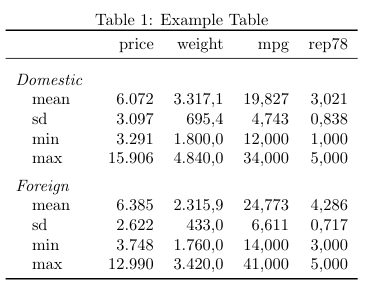

- [mat2tex: a command to export a stata matrix to a body of a latex table](#mat2tex-a-command-to-export-a-stata-matrix-to-a-body-of-a-latex-table)
- [Motivation](#motivation)
- [Installation](#installation)
- [Usage](#usage)
  - [Simple use case](#simple-use-case)
  - [Appending group by group (a little) complex option](#appending-group-by-group-a-little-complex-option)
  - [All in one (a little more) complex option](#all-in-one-a-little-more-complex-option)
- [Syntax and options](#syntax-and-options)
- [Acknowledgements](#acknowledgements)

mat2tex: a command to export a stata matrix to a body of a latex table 
======================================================================


# Motivation 

The idea of the package is to provide a very simple workflow for updating TeX
tables in a reproducible manner. There are some very good stata packages that
can produce very good looking tables with plenty of options covering a broad set
of use cases. See [frmttable](http://fmwww.bc.edu/RePEc/bocode/f/frmttable.html)
for a good example. There are also packages that produces simple LaTeX tables
from stata's matrices. For a really good overview, look at [lukestein's
page](https://lukestein.github.io/stata-latex-workflows/). 

In my workflow however, I often need only to update the body of LaTeX table, and
the rest of it's aesthetics and commands, such as `\caption` or `\label` can be
better managed directly in the LaTeX project itself.  

With this in mind, the idea of this package is to export only the table body to
a **.tex** file and this file should be included within the table in the LaTeX
project. So, as soon as the **.tex** file is updated (or uploaded to overleaf.
By the way, if you don't have an account on
[overleaf](https://www.overleaf.com), go there and make one, I'll wait here...)
Where were we? Tables... yes... as soon as they are updated, the LaTeX project
will be compiled with the new information, no need to manually touch the
**.tex** file. As a bonus, this program ships the table with a latex comment on
the date of creation. The user can also pass some further comments to be added
(but invisible in the compiled PDF) to the table, because since the table is
stripped from its surrounding, a nice comment (better would be a nice name, but
naming things are hard) can be helpful not to link the wrong table in the right
place, or the right table in the wrong place or the wrong table in the wrong
place... 


# Installation 


If you want to check what you are installing
```
net from https://raw.githubusercontent.com/avila/mat2tex/master/
net describe mat2tex 
net install mat2tex
```

or just go for it
``` 
net install mat2tex, from(https://raw.githubusercontent.com/avila/mat2tex/master/)
```

# Usage 

Note that the program is designed for simple use cases. For more complex use
cases there are [enough packages out
there](https://lukestein.github.io/stata-latex-workflows). 

## Simple use case 

- Generate the table from stata 

```stata
sysuse auto
* set dp comma // could (should?) be dealt with from latex, but can be done here
tabstat price weight mpg rep78, by(foreign) stat(mean sd min max) nototal long save
mat mat_to_export = r(Stat1) \ r(Stat2)
mat2tex using table_example.tex, matrix(mat_to_export) replace /// 
    comm(data from auto dataset) format(%9.2fc)
```

- this will output a tex file like so: 

```latex
% 29 Mar 2020 | 22:55:51 
% data from auto dataset
%       & price & weight        & mpg   & rep78 & 
mean    &  6.072,42     &  3.317,12     &     19,83     &      3,02 \\
sd      &  3.097,10     &    695,36     &      4,74     &      0,84 \\
min     &  3.291,00     &  1.800,00     &     12,00     &      1,00 \\
max     & 15.906,00     &  4.840,00     &     34,00     &      5,00 \\
mean    &  6.384,68     &  2.315,91     &     24,77     &      4,29 \\
sd      &  2.621,92     &    433,00     &      6,61     &      0,72 \\
min     &  3.748,00     &  1.760,00     &     14,00     &      3,00 \\
max     & 12.990,00     &  3.420,00     &     41,00     &      5,00 \\
``` 
Note: the three first lines are LaTeX comments. The commentd header is there
only to help indentify if which column is what. As you can see, the table is not
pretty printed. (Pretty printing is pretty difficult!) and if the numbers are
less homogenous or the column names have different lenght, it will look more
messy. But LaTeX doesn't care much for input aesthetics, only output!


- Create a table structure in LaTeX such as the following, and include the
  generated body in the table structure.

```latex
\begin{table}
\centering
    \caption{Example Table}
    \begin{tabular}{ l rr rr }
    \toprule
    %% here you write the table headers by hand
       & price & weight & mpg & rep78 \\
    \midrule
    %% here you input the table body
    \input{table_example.tex} % include table file
    \bottomrule
    \end{tabular}%
\end{table}%
``` 


Maybe the reader already realized that the above table is somewhat ambigous, as
there are two groups of variables being displayed. In these cases, either use
[frmttable](http://fmwww.bc.edu/RePEc/bocode/f/frmttable.html) or other package
or try one of the more complex possibilities as shown in the next sections.


## Appending group by group (a little) complex option 

The other option is to divide (or just not merge) stata's matrix into each group
and append each table accordingly. This might be better suited if it is easy to
keep the stata matrices apart from the start. The grouptitle function comes
in handy here.

```stata
mat group_1 = r(Stat1)
local gt  "\rowgroupemph{Domestic}\\" // just to show that locals can be used too
mat2tex using table_example, matrix(group_1) replace  ///
    format(%9.0fc %9.1fc %9.3fc %9.3fc) grouptitle(`gt')

mat group_2 = r(Stat2)
mat2tex using table_example, matrix(group_2) append  notiming ///
    format(%9.0fc %9.1fc %9.3fc %9.3fc) grouptitle(\rowgroupemph{Foreign}\\)
```
For that, you will need a table in latex such as the following. 

```
% 30 Mar 2020 | 20:59:06 
%       & price & weight        & mpg   & rep78 & 
\rowgroupit{Domestic}\\
mean    &     6.072     &   3.317,1     &      19,8     &     3,021 \\
sd      &     3.097     &     695,4     &       4,7     &     0,838 \\
min     &     3.291     &   1.800,0     &      12,0     &     1,000 \\
max     &    15.906     &   4.840,0     &      34,0     &     5,000 \\
%       & price & weight        & mpg   & rep78 & 
\rowgroupit{Foreign}\\
mean    &     6.385     &   2.315,9     &      24,8     &     4,286 \\
sd      &     2.622     &     433,0     &       6,6     &     0,717 \\
min     &     3.748     &   1.760,0     &      14,0     &     3,000 \\
max     &    12.990     &   3.420,0     &      41,0     &     5,000 \\
```

```latex
% include command in preamble or before table
\newcommand{\rowgroupemph}[1]{\hspace{-1em}\emph{#1} \rule{0pt}{3ex} }
% ...
\begin{table}
\centering
    \caption{Example Table}
    \begin{tabular}{ >{\quad}l rr rr }
    \toprule
    %% here you include the table headers by hand
    & price         & weight                & mpg           & rep78 \\
    \midrule
    \input{table_example.tex} % include table file
    \bottomrule 
    \end{tabular}%
\end{table}%
```




## All in one (a little more) complex option 

```stata
sysuse auto
* set dp comma // could (should?) be dealt with from latex, but can be done here
tabstat price weight mpg rep78, by(foreign) stat(mean sd min max) nototal long save
mat mat_to_export = r(Stat1) \ r(Stat2)
mat2tex using table_example, matrix(mat_to_export) replace comm(data from auto dataset) ///
    format(%9.0fc %9.1fc %5.3fc %5.3fc) rownames(/// 
    "\rowgroupemph{Domestic} \\ mean"              ///
    "sd"                                         ///
    "min"                                        ///
    "max"                                        ///
    "\rowgroupemph{Foreign} \\ mean"               ///
    "sd"                                         ///
    "min"                                        ///
    "max" )
```

which will produce a table such as: 

```latex
% 30 Mar 2020 | 03:16:15 
% data from auto dataset
%       & price & weight        & mpg   & rep78 & 
\rowgroupemph{Domestic} \\ mean   &     6.072     &   3.317,1     &    19,827     &     3,021 \\
sd      &     3.097     &     695,4     &     4,743     &     0,838 \\
min     &     3.291     &   1.800,0     &    12,000     &     1,000 \\
max     &    15.906     &   4.840,0     &    34,000     &     5,000 \\
\rowgroupemph{Foreign} \\ mean    &     6.385     &   2.315,9     &    24,773     &     4,286 \\
sd      &     2.622     &     433,0     &     6,611     &     0,717 \\
min     &     3.748     &   1.760,0     &    14,000     &     3,000 \\
max     &    12.990     &   3.420,0     &    41,000     &     5,000 \\
```


It will produce such a table (The latex structure and the compiled PDF will be
the same as the ones above):


Pay attention to the `\begin{tabular}{ >{\qquad}l rr rr }` environment
initialization. the `>{\qquad}l` part instructs the first column of the table to
be aligned left but with a `\qquad` spacing in each row. the \rowgroupemph
command, however, makes each group title to negatively indented by _-1em_. Adapt
it to your liking or disliking.

- But how did it work? (I was also surprised that it didn't break stata or
  LaTeX). 

It works by including a LaTeX line break (`\\`) in the first variable of each
group and passing the group title as argument for the `\rowgroupemph` latex
command (that has to be added to the preample or somewhere before the table),
such as `"\rowgroupemph{Domestic} \\ mean"`.  

This explanation is mainly here to show that with a little tinkering, one can
still produce slightly more complex tables with `mat2tex`. Bud just because you
can, does not mean you should! 

Another option would be create multiple sub-tables in separated files and merge
them back together in the LaTeX project via multiple `\input{}`.


# Syntax and options


- `matrix(name)` Matrix to be exported into tex (Required).

- `replace` Replaces existing filename (or writes a new, if inexistent).

- `append` Appends table to existing filename. This can be useful when creating
  a single table from multiple matrices. `grouptitle` option can be useful to
  create a group separation within the table body.

- `notiming` Do not include date and time of table creation, which is included by
default.

- `comment(str)` Include additional comment that might be helpful to indentify the
origin of table body.

- `format(str)` Format of each column of matrix (Default: "%12.0g").  If only one
    included it is applied to all columns, otherwise it is applied in a 1 by 1
    manner. See help format for more information on formating options. If less
    format arguments are passed than number of columns of matrix, I believe
    stata is crazy enough to cycle through the rest of the columns matrix with
    last format given by the user ¯\_(ツ)_/¯.  mat2tex won't check mathing
    lengths in formating arguments and matrix columns. The format options is not
    applied to the rownames (first column)

- `rownames(str asis)` Accepts quoted strings separated blank spaces. No comma
    between names!.  It can be usefull to circunvent 32 chars maximum string
    lenght of stata's matrix rownames. Make sure to match the number of rows of
    the matrix. Presently, colnames are not used here and should be directly
    adapted in LaTeX's table headers.

- `grouptitle(str asis)` When appending sub-tables grouptitle might be useful.
  Strings must be quietly Do not print output onto results window.

# Acknowledgements

The heavy lifting was done by the authors of the `mat2txt` package Michael
Blasnik & Ben Jann. 